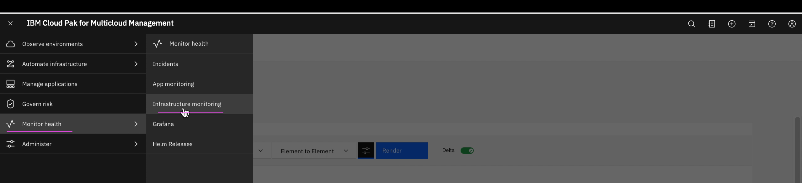
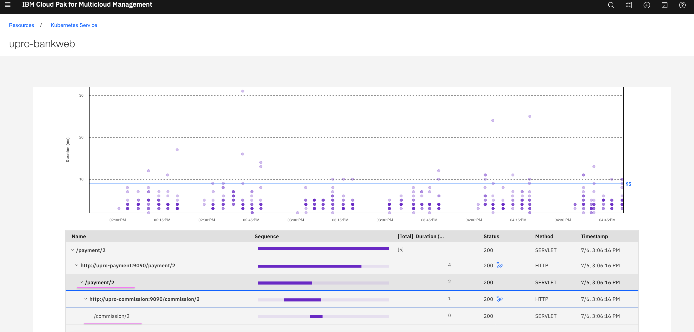

# Installing Upro App in IBM Cloud Pak for Multicloud Management Version 1.3.0/1.3.2 


## 1. Preparation

### 1.1 Download 

Download this project from git

### 1.2 Change the Placement rule.

a. Open the file `src/03-subscription/21-placement.yaml`. The cluster related details should be like this.

```
  clusterLabels:
    matchExpressions:
      - key: name
        operator: In
        values:
        - ocp43-mcm-gan-a
```

b. Replace the value `ocp43-mcm-gan-a` with your cluster name.


### 1.3 Obtain the Hub server config info.

1. Obtain the hub server config info using the below url. As as result you might have downloaded with `ibm-cloud-apm-dc-configpack.tar`.

https://www.ibm.com/support/knowledgecenter/SSFC4F_1.3.0/icam/dc_config_server_info.html


2. Extract the `ibm-cloud-apm-dc-configpack.tar` into the folder `datacollector/ibm-cloud-apm-dc-configpack`.

Now you should have the below files and folders.

```
datacollector/ibm-cloud-apm-dc-configpack/keyfiles
datacollector/ibm-cloud-apm-dc-configpack/dc-secret.yaml
datacollector/ibm-cloud-apm-dc-configpack/global.environment
datacollector/ibm-cloud-apm-dc-configpack/readme.md
```

### 1.4 Update the Secret with Hub config info

1. Goto `install` folder in command prompt.

2. Run the below command to create icam-server-secrets.

```
sh 52-generate-icam-server-secret.sh
```

It will print the values in the console.

3. Copy the content of the last 4 properties listed in the console above and replace it in the file `src/02-channel/20-deployable-common.yaml`

```
global.environment: dGVzdA==
keyfile.jks: dGVzdA==
keyfile.kdb: dGVzdA==
keyfile.p12: dGVzdA==
```

------------

## 2.Installation

### 2.1 Log in to the hub cluster as an `account administrator`

Run the below command.

```
cloudctl login -a <cluster URL> -u <account-admin-username> -p <account-admin-password> --skip-ssl-validation -c <account ID or name> -n <namespace>
```

ex:
```
cloudctl login -a https://icp-console.ocp43-mcm-132-gan-7ec.us-east.containers.appdomain.cloud -u mcmaccadmin -n default --skip-ssl-validation
```

### 2.2 Create Namespace

1. Goto `install` folder in command prompt

2. Run the below command to creat a namespace. 

```
sh 11-install-namespace-in-hub.sh
```

### 2.3 Patch the right `account id` in the namespace.

Replace `2a82-45f9` with right `account id` and run the below command.

```
kubectl annotate --overwrite namespace upro-icam-channel-ns mcm.ibm.com/accountID='2a82-45f9'
kubectl annotate --overwrite namespace upro-icam-subscription-ns mcm.ibm.com/accountID='2a82-45f9'
kubectl annotate --overwrite namespace upro-icam-app-ns mcm.ibm.com/accountID='2a82-45f9'
```

### 2.4 Log in to the hub cluster as an **account operator**

Login into hub cluster as an **account operator**. If you don't have operator user, stick to the account administrator  user.

```
cloudctl login -a <cluster URL> -u <account-admin-username> -p <account-operator-password> --skip-ssl-validation -c <account ID or name> -n <namespace>
```

### 2.5 Install the app in Hub

1. Goto `install` folder in command prompt

2. Run the below command to install.

```
sh 01-install.sh
```

The application get installed in the mcm hub. Based the placement rule the deployables are placed on the right managed cluster.

------------

## 3. Accessing the installed application

1. Login into the managed cluster with ` oc login`  command

2. Run the below command to find the routes installed.

```
oc get route -n upro-icam-app-ns
```

It may result like the below.

```
NAME              HOST/PORT                                                                                                            PATH   SERVICES          PORT      TERMINATION   WILDCARD
upro-bankweb      upro-bankweb-upro-icam-app-ns.gdomain.cloud      /      upro-bankweb      my-http                 None
upro-commission   upro-commission-upro-icam-app-ns.gsiiners.appdomain.cloud   /      upro-commission   my-http                 None
```

3. Copy the route from the above output and open the url in the browser.

ex:
```
http://upro-bankweb-upro-icam-app-ns.gdomain.cloud 
```

------------

## 4. Viewing Golden Signals

## 4.1 Generate Load

Lets generate some load to see the golden signals.

1. Open the file `install/51-continous-trafic.sh`.

2. In the above file, replace the `http://upro-bankweb-upro-icam-appdomain.cloud` with the route that you got in the above step.

3. Goto `install` folder in command prompt

4. Run the below command to generate load to the deployed app.

```
sh 51-continous-trafic.sh
```

After few minute of run, you can put Ctrl+C to stop the execution.

## 4.2 View Applications

1. Goto MCM Hub console UI.

2. Click `Manage Applications` menu to open the application screen.


3. Click on `Upro applications` link.


It will open the application resources toplogy screen.


## 4.3 View Applications Topology

1. Click on `Monitor Health > App Monitoring` menu to open the application monitoring screen.


3. Click on `Upro applications` link.


It will open the application toplogy screen.


## 4.4 View Golden Signals

1. Click on `Monitor Health > Infrastructure Monitoring` menu to open the monitoring screen.




The list of resources displayed.


2. Click on `Kubernetes Service` link.

List of kubernetes services displayed.


3. Click on `Upro bankweb Service` link.

It will open the Golden Signals page.


4. Click on `Service dependencies` to see the service dependencies page.

This will shows us how the services are related.


5. Click on `Tracing icon` to see the transaction details page.




------------